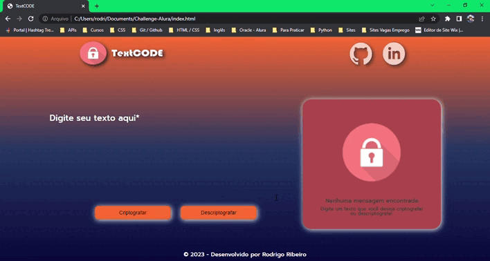

# 💻 Challenge-Alura 1 

#TextCODE

## 📝 Descrição

Primeiro desafio do curso ONE, parceria entre Oracle e Alura.

Desfaio: Desenvolver um decodificador de texto capaz de criptografar e descriptografar palavras de acordo com as regras a seguir:

- A letra "a" é convertida para "ai"
- A letra "e" é convertida para "enter"
- A letra "i" é convertida para "imes"
- A letra "o" é convertida para "ober"
- A letra "u" é convertida para "ufat"

## 📚 Funcionalidades

- Deve funcionar apenas com letras minúsculas;
- Não devem ser utilizados letras com acentos nem caracteres especiais;
- Deve ser possível converter uma sentença para a versão criptografada e também retornar uma sentença criptografada para a versão original;

Exemplo:

`"gato" => "gaitober"`
`"gaitober" => "gato"`

- A página deve ter campos para inserção do texto a ser criptografado ou decriptografado, e o usuário deve poder escolher entre as duas opções;
- O resultado deve ser exibido na tela;
- Deve adicionar um botão de copiar no campo de resultado;

Métodos para melhora do código:
- Código Responsivo;
- Método .toLowerCase() para transformar texto informado todo em letra minúscula;

## Linguagens utilizadas:

